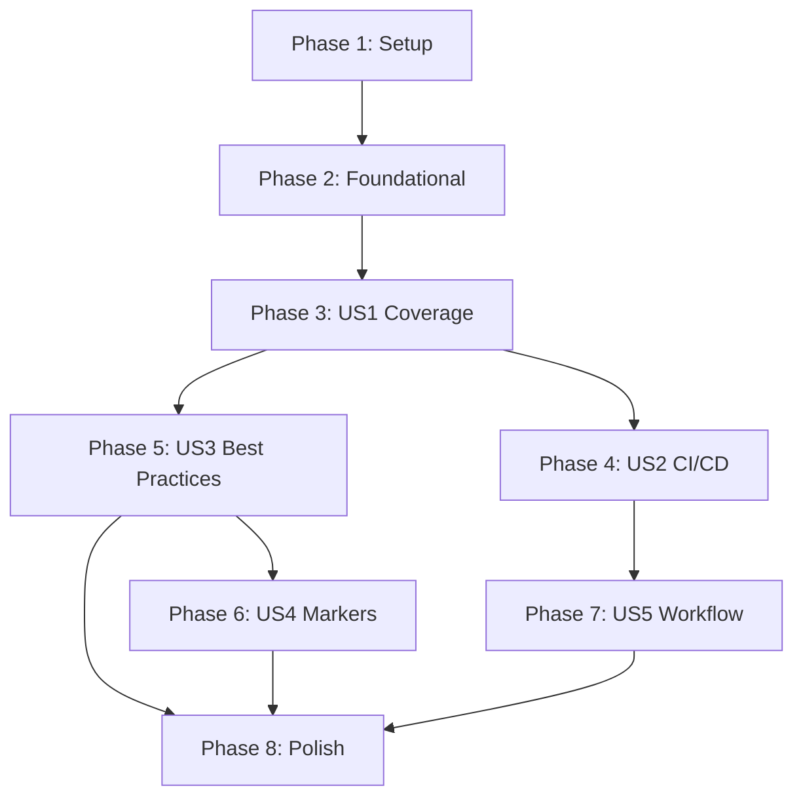

# Tasks: Improve Testing Infrastructure

**Feature**: Improve Testing Infrastructure  
**Feature Branch**: `002-improve-testing`  
**Generated**: 2026-01-16  
**Plan**: [Link](plan.md) | **Spec**: [Link](spec.md)

## Summary

| Metric | Value |
|--------|-------|
| Total Tasks | 32 |
| User Stories | 5 |
| Parallelizable Tasks | 8 |
| MVP Scope | Phase 1-4 (US1 + US2) |

## Task Count by User Story

| User Story | Tasks | Phase |
|------------|-------|-------|
| US1: Unit Test Coverage Improvement | 6 | Phase 3 |
| US2: CI/CD Pipeline for Testing | 4 | Phase 4 |
| US3: Apply Testing Best Practices | 5 | Phase 5 |
| US4: Test Organization and Markers | 5 | Phase 6 |
| US5: GitHub Actions Workflow | 4 | Phase 7 |

---

## Phase 1: Setup

**Goal**: Initialize pytest configuration and test dependencies.

- [ ] T001 Create pytest.ini in project root with coverage configuration
- [ ] T002 Update pyproject.toml to add test dependencies (pytest-cov, pytest-mock, pytest-xdist)

**Independent Test Criteria**: `pytest --version` and `pytest --collect-only` work without errors.

---

## Phase 2: Foundational

**Goal**: Create shared fixtures and test utilities that all user stories depend on.

- [ ] T003 Create tests/conftest.py with session-scoped test_config fixture
- [ ] T004 Create tests/fixtures/ directory with sample HTML fixtures
- [ ] T005 [P] Create mock_driver fixture in tests/conftest.py for Selenium mocking

**Independent Test Criteria**: `pytest tests/conftest.py` passes and fixtures are discoverable.

---

## Phase 3: US1 - Unit Test Coverage Improvement

**Goal**: Achieve 70% unit test coverage for src/ directory.

**Independent Test Criteria**: `pytest --cov=src --cov-report=term-missing` shows 70%+ coverage.

### Implementation Tasks

- [ ] T006 [US1] Add unit tests for src/domain/entities.py
- [ ] T007 [US1] Add unit tests for src/storage/field_filter.py
- [ ] T008 [US1] Add unit tests for src/storage/json_storage.py
- [ ] T009 [US1] Add unit tests for src/config.py
- [ ] T010 [US1] Add unit tests for src/logging_config.py
- [ ] T011 [P] [US1] Verify coverage report shows 70%+ for src/

---

## Phase 4: US2 - CI/CD Pipeline for Testing

**Goal**: Implement automated testing pipeline with coverage gates.

**Independent Test Criteria**: GitHub Actions workflow runs on push and fails if coverage < 70%.

### Implementation Tasks

- [ ] T012 Create .github/workflows/test.yml with Python setup and uv dependency install
- [ ] T013 [US2] Configure CI to run pytest with coverage and cov-fail-under=70
- [ ] T014 [US2] Add Codecov upload step to GitHub Actions workflow
- [ ] T015 [P] [US2] Add branch protection rules documentation (README update)

---

## Phase 5: US3 - Apply Testing Best Practices

**Goal**: Ensure all tests follow AAA pattern and testing best practices from .specify/memory/testing-best-practices.md.

**Independent Test Criteria**: Review checklist in .specify/memory/testing-best-practices.md shows all items pass.

### Implementation Tasks

- [ ] T016 [US3] Refactor existing tests in tests/unit/test_entities.py to follow AAA pattern
- [ ] T017 [US3] Refactor tests/unit/test_json_storage.py to follow AAA pattern
- [ ] T018 [US3] Refactor tests/scrapers/test_shop_scraper.py to follow AAA pattern
- [ ] T019 [P] [US3] Add docstrings to all test functions
- [ ] T020 [P] [US3] Verify tests use mocking for external dependencies (network, filesystem)

---

## Phase 6: US4 - Test Organization and Markers

**Goal**: Implement pytest markers for test categorization and enable subset execution.

**Independent Test Criteria**: `pytest -m "not slow"` runs only fast tests successfully.

### Implementation Tasks

- [ ] T021 [US4] Add custom markers to pytest.ini (unit, integration, slow, scraping)
- [ ] T022 [US4] Mark unit tests in tests/unit/ with @pytest.mark.unit
- [ ] T023 [US4] Mark integration tests in tests/integration/ with @pytest.mark.integration
- [ ] T024 [US4] Mark slow tests with @pytest.mark.slow
- [ ] T025 [P] [US4] Verify marker execution works (pytest -m unit, pytest -m integration)

---

## Phase 7: US5 - GitHub Actions Workflow

**Goal**: Complete GitHub Actions workflow with proper artifact handling and status reporting.

**Independent Test Criteria**: Workflow runs on PR and displays status check in GitHub UI.

### Implementation Tasks

- [ ] T026 [US5] Add timeout-minutes: 15 to CI job
- [ ] T027 [US5] Add coverage artifact upload to workflow
- [ ] T028 [US5] Add workflow badge to README.md
- [ ] T029 [P] [US5] Document CI workflow in docs/developer-guide.md

---

## Final Phase: Polish & Cross-Cutting

**Goal**: Finalize documentation and ensure project-wide consistency.

- [ ] T030 Update .specify/memory/testing-best-practices.md with actual project examples
- [ ] T031 Update docs/developer-guide.md with testing section
- [ ] T032 Create tests/README.md with testing guidelines for contributors

---

## Dependency Graph



**Story Dependencies**:
- US1 → US2 (CI/CD needs coverage threshold)
- US1 → US3 (Best practices applied to existing tests)
- US3 → US4 (Markers applied to tests following best practices)
- US2 → US5 (Workflow completion)

---

## Parallel Execution Examples

Tasks marked with `[P]` can run in parallel:

### Setup Phase
- T001, T002 run sequentially (both required for setup)

### Foundational Phase
- T003, T004, T005: T003 first (conftest), then T004 and T005 in parallel

### US1 Phase
- T006-T010: Sequential (each builds on fixture setup)
- T011: After T006-T010 complete (verification task)

### US3 Phase
- T016-T018: Can run in parallel (refactoring independent tests)
- T019: Parallel with T016-T018 (docstrings)
- T020: After T016-T018 complete (verification task)

### US4 Phase
- T021: First (defines markers)
- T022-T024: Parallel (marking tests independently)
- T025: After T022-T024

---

## MVP Scope

**Minimum Viable Product** includes:
- Phase 1: T001, T002
- Phase 2: T003, T004, T005
- Phase 3: T006-T011 (all 6 tasks)
- Phase 4: T012-T014

This delivers:
1. ✅ Pytest with coverage configuration
2. ✅ Shared fixtures (mock_driver, test_config)
3. ✅ 70% unit test coverage
4. ✅ Working CI/CD pipeline

**Estimated Tasks to MVP**: 13 of 32 (41%)

---

## Implementation Strategy

### MVP First (Phase 3-4)
1. Configure pytest and dependencies
2. Create basic fixtures
3. Write tests to reach 70% coverage
4. Set up CI/CD pipeline

### Incremental Delivery
1. **After Phase 4**: CI/CD pipeline runs, coverage enforced
2. **After Phase 5**: All tests follow AAA pattern
3. **After Phase 6**: Test categorization with markers
4. **After Phase 7**: Complete GitHub Actions workflow

---

## Verification Commands

```bash
# Verify setup
pytest --version
pytest --collect-only

# Verify foundational
pytest tests/conftest.py -v

# Verify MVP (US1 + US2)
pytest --cov=src --cov-report=term-missing --cov-fail-under=70
pytest tests/unit/ tests/scrapers/

# Verify US3 (Best Practices)
pytest tests/ --collect-only -q | grep -c "test_"

# Verify US4 (Markers)
pytest -m unit -v
pytest -m integration -v
pytest -m "not slow" -v

# Verify US5 (CI)
# Push to branch and check GitHub Actions
```
